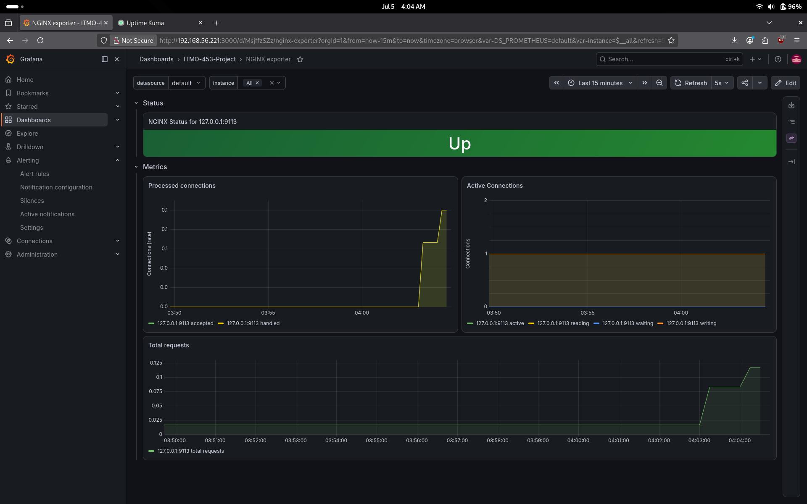
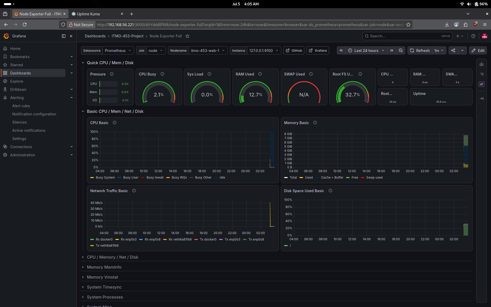
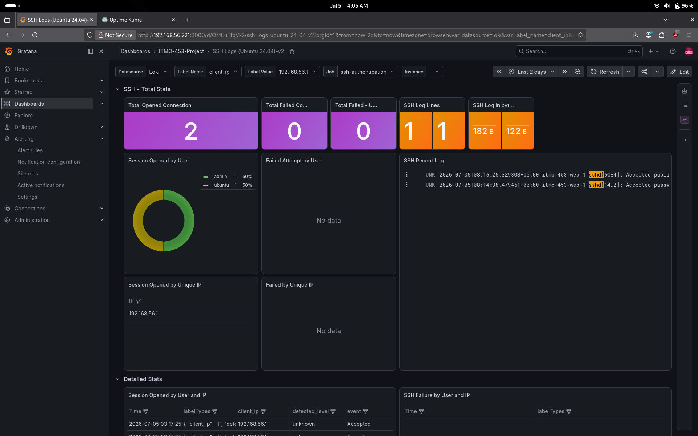

# Operational Report

## General Overview

This system is managed and configured completely via code and represents a simple example of infrastructure as code. All administrative tasks are performed via either bash scripting or through the use of YAML configuration files. This allows any administrator the ability to automate the majority of work that is needed to be done to both setup and maintain the system. Monitoring is built in which allows for real time collection and analysis of metrics. This allows for administrators to always know the status of the system and take action if a failure or an ineffeciency presents itself.

## Monitoring Platforms

### Grafana

The main monitoring platform of choice for this system is Grafana with prometheus and loki as data sources. The Grafana web interface is available at port 3000 while prometheus is available at port 9090. Prometheus collects data from node and nginx exporter and passes it to grafana for general system/infrastructure overview, while the loki service is used in combination with the alloy service to read the auth log and collect information about ssh logins. This information is then sent to Grafana and displayed on the SSH dashboard.

## Metrics Dashboards

This system makes use of three premade grafana dashboards which were designed to monitor node-exporter and nginx-exporter. These dashboards provide visualization for basically any relevant metric that is exposed by these two exporters. The third dashboard is a modified version of 

### Nginx Exporter Dashboard

### Node Exporter Dashboard

### SSH Dashboard

### Alerts

This system is configured to provide administrators with email alerts via Grafana. There are three types of alerts on this system: Hardware Alerts, SSH Alerts, and Service Failure Alerts. Grafana is configured with smtp to send alerts to an email contact point which will let all system administrators know when something has gone wrong. 

### Alert Dashboard

### Test Alert Demonstration

### Uptime-Kuma

The uptime-kuma service is also installed and available through the web browser at port 3001. This is used to monitor statistics about a particular service such as nginx or prometheus as well as any outages that those services may have had. It does not fully support automatic provisioning but an administrator can easily import a backup using a json file when first logging in to the web interface. 

### Uptime-Kuma Dashboard

## Data Flow

The data flow in the system is rather straightforward. Data originates either from one of the two exporters or directly from the auth log. The data is then processed by either Prometheus or by Grafana. If the data matches an alert condition determined by Grafana it will fire an alert to email.

## Collected Metrics

The main metrics that are being collected are: CPU Usage, Memory Usage, Disk Capacity, Systemd Service Status, and Successful SSH Logins.

## Alert Logic Breakdown

### Service Alerts

Whenever a systemd service enters the failed state it is picked up by prometheus and sent to grafana. Grafana will then fire the alert and an administrator will be notified via email that there is a failing service on the system.

### Login Alerts

Whenever there is a successful SSH login to the system alloy will send the data to loki. Grafana retrieves the data from loki and then fires an alert. The reason as to why the alert files on successful logins as opposed to failed ones is because at the end of the day a failed login isn't really a cause for concern because it doesn't really mean anything on it's own. A successful login however is very much cause for concern if it occurred during an unusual time.

### Hardware Alerts

Whenever prometheus detects that CPU or memory usage is at 90% or disk capacity is only at 10% grafana will fire an alert informing the administrator about the problem. This is done so that the administrator can adjust resources as needed to prevent the system from being overloaded.

## Discussion

### Observability

Observability is essential to any complex system. Real world systems are comprised of many services and many machines. Maintaining these systems takes time and effort. Without any way of monitoring systems problems cannot be reliably identified in a timely manor. This increases downtime and makes it difficult for an organization to achieve it's goals. Administrators need to design systems that can be monitored and observed so that failures can be quickly identified and fixed. Observability is also important from a cybersecurity standpoint. Security teams need to be able to monitor potentially suspicious activity on their systems so that they can identify intrusions and prevent further incidents.

### Monitoring Limitations

No monitoring tool is perfect, and Grafana does come with some limitations as well as challenges when it comes to it's implementation. Grafana is able to help an administrator monitor almost anything, but in order to use it to it's full potential an administrator needs to be able to either build dashboards themselves or find premade ones that suit their needs. This can be difficult and extremely time consuming because the administrator will likely need to learn how to craft their own dashboards as well as how to query and present data. Most alerts are also not in real time. There is usually roughly a minute or two of delay from when something triggers an alert to when the administrator is actually alerted. This is not a huge limitation but it does lead to some downtime when services go down.

### False Positives and False Negatives

A false positive occurs when an alert triggers under non serious circumstances. For example, this system is configured to alert whenever someone logs in successfully with SSH. This is intended to alert administrators of a security breach, but it will also fire whenever a legitimate login happens. This is an example of a false positive. The alert itself doesn't really have any way of knowing the context behind a login so it will fire regardless of whether or not there is an actual security incident. Occasional false positives are fine, but if too many alerts are triggering when nothing is actually happening then admins will start to ignore them and the alerts are no longer doing their intended job. 

A false negative occurs when something problematic happens but the alert does not trigger because it isn't configured correctly. For example, lets say that an administrator wanted to make an alert for high CPU usage. The administrator decided that the alert should trigger if the cpu is at 99% for more than 5 minutes. This may seem ok at first, but it could lead to some problems. Occasional CPU spikes do happen and are relatively normal. The administrator likely wanted to prevent false positives, but in doing so they have created an alert that might never actually trigger. If a servers CPU is sitting at 99% for 5 minutes then its very likely that the server may either overheat or crash before the alert even has a chance to fire.

### Security Visibility

In this system SSH logins are visible on a dedicated dashboard. Every successful connection is logged and monitored. Administrators are able to see who logged in and when they logged in. This allows for easy observability and auditing. Suspicious logins can be investigated and any user accounts that should have been blocked but havent been are easily identifiable.

### Operational Maintenance Strategy

A typical workflow for an administrator on this system would be to log into the Grafana webapp and monitor the system through one of the three included dashboards. From that point on the administrator could analyze trends such as typical CPU usage, average memory usage, The amount of traffic that is present on the website at any point in time, etc. These types of metrics can then be used to make administrative decisions.

For example, the administrator could note that there has been an increase in traffic to the webserver over the last couple of days and then take a look at system resource usage. If usage is significantly higher than the administrator could take action to fix this via provisioning more resources to the system by either allocating more to that system, or by implementing load balancing with multiple webservers instead.

Major configuration changes are performed via ansible. This is a crucial aspect of configuring and working on this system. Ansible provides an easy way to store important configuration and also ensure that each step of configuring the server was performed correctly. It also helps with organizing and auditing changes that are made to the system so that there is never any doubt as to how the system is configured. 

Grafana supports provisioning for dashboards, data sources, and alerts. If the system has new components, or the administrator decides to add new types of monitoring then grafana can be easily configured through json and yaml files. All configuration in this system can be managed as code.