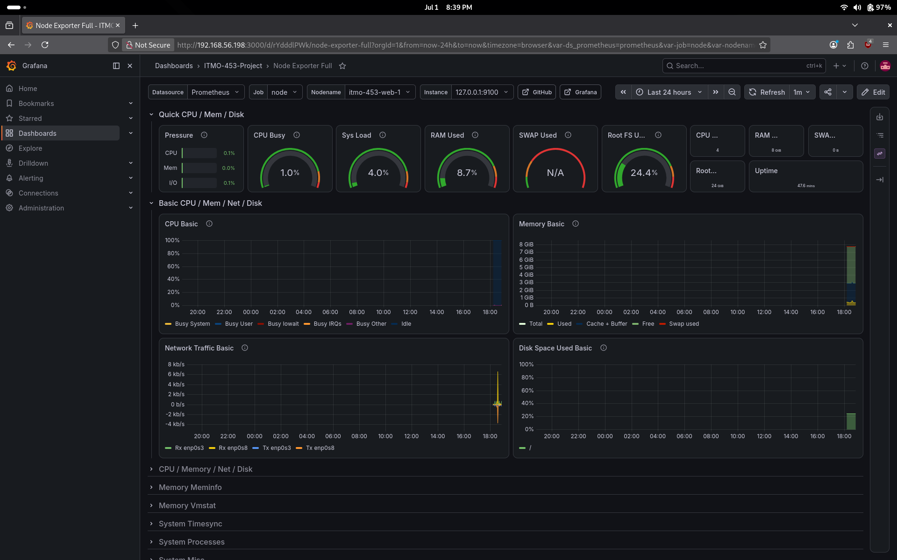
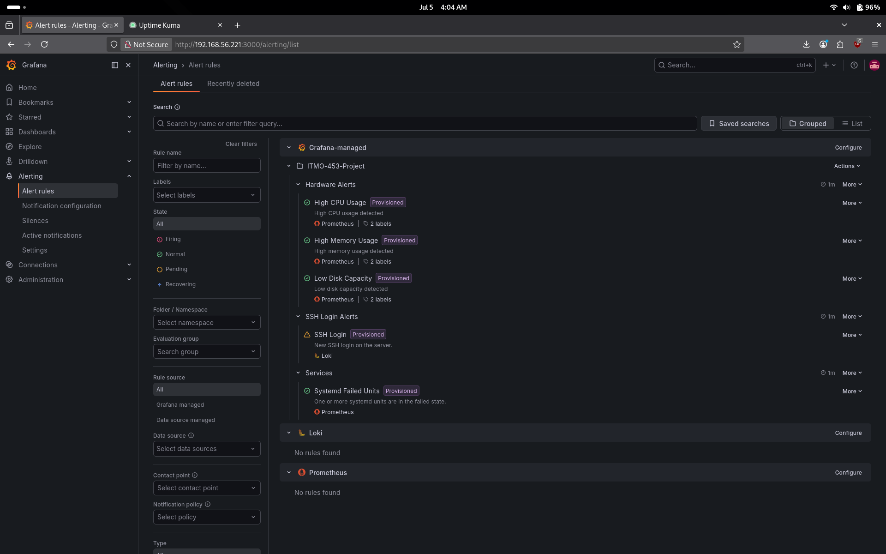
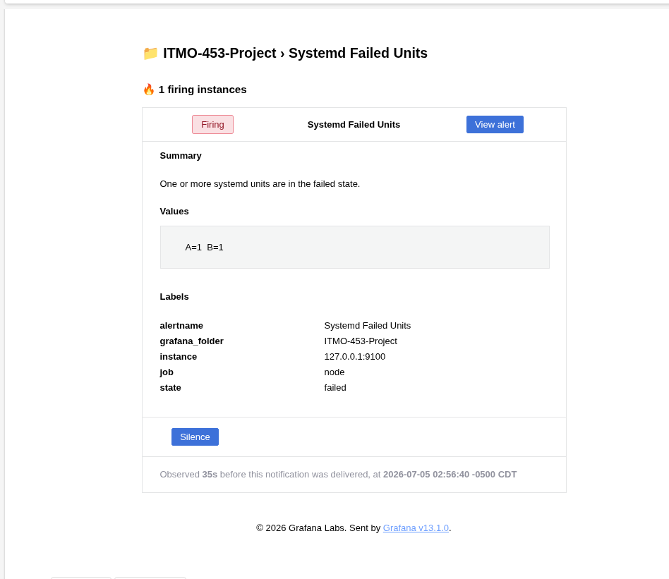
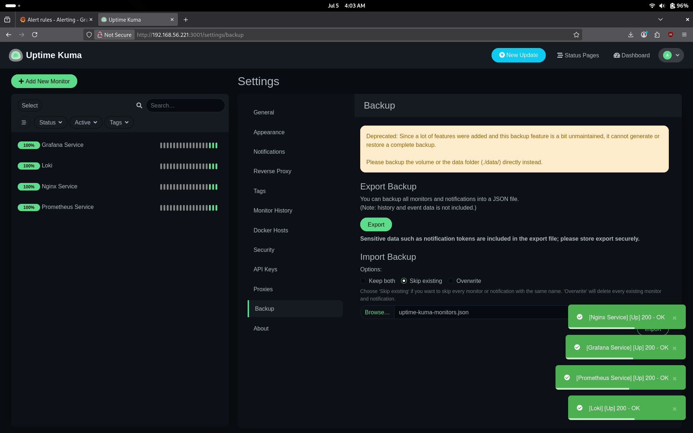
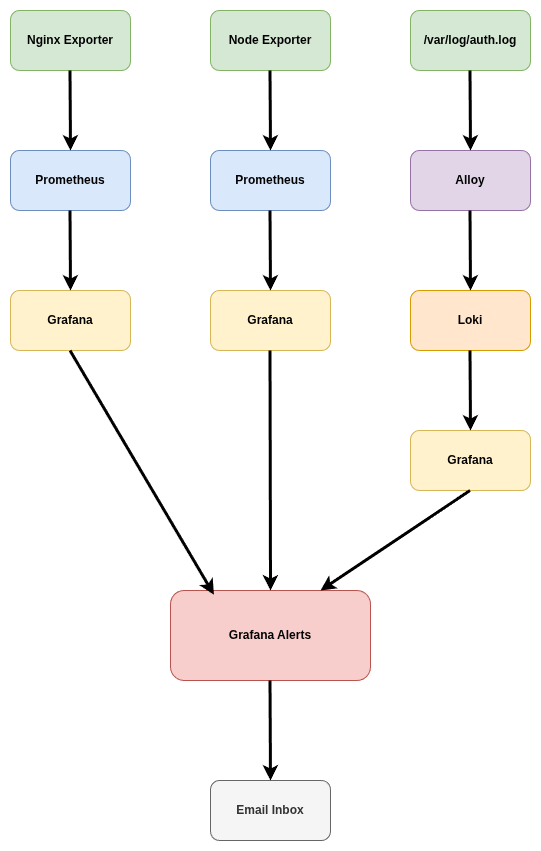

# Operational Report

## General Overview

This system is managed and configured completely via code and represents a simple example of infrastructure as code. All administrative tasks are performed via either bash scripting or through the use of YAML configuration files. This allows any administrator the ability to automate the majority of work that is needed to be done to both setup and maintain the system. Monitoring is built in which allows for real time collection and analysis of metrics. This allows for administrators to always know the status of the system and take action if a failure or an ineffeciency presents itself.

A typical workflow for an administrator on this system would be to log into the Grafana webapp and monitor the system through one of the two included dashboards. From that point on the administrator could analyze trends such as typical CPU usage, average memory usage, The amount of traffic that is present on the website at any point in time, etc. These types of metrics can then be used to make administrative decisions.

For example, the administrator could note that there has been an increase in traffic to the webserver over the last couple of days and then take a look at system resource usage. If usage is significantly higher than the administrator could take action to fix this via provisioning more resources to the system by either allocating more to that system, or by implementing load balancing with multiple webservers instead.

Major configuration changes are performed via ansible. This is a crucial aspect of configuring and working on this system. Ansible provides an easy way to store important configuration and also ensure that each step of configuring the server was performed correctly. It also helps with organizing and auditing changes that are made to the system so that there is never any doubt as to how the system is configured. 

## Monitoring Platforms

### Grafana

The main monitoring platform of choice for this system is Grafana with prometheus and loki as data sources. The Grafana web interface is available at port 3000 while prometheus is available at port 9090. Prometheus collects data from node and nginx exporter and passes it to grafana for general system/infrastructure overview, while the loki service is used in combination with the alloy service to read the auth log and collect information about ssh logins. This information is then sent to Grafana and displayed on the SSH dashboard.

## Metrics Dashboards

This system makes use of two premade grafana dashboards which were designed to monitor node-exporter and nginx-exporter. These dashboards provide visualization for basically any relevant metric that is exposed by these two exporters. There is also a custom made dashboard designed to count the number of successful SSH connections as well as the number of failed SSH connections. This can be used as a way of knowing how many unauthorized people are attempting to get into the server.

### Nginx Exporter Dashboard

### Node Exporter Dashboard

### SSH Dashboard

### Alerts

This system is configured to provide administrators with email alerts via Grafana. There are three types of alerts on this system: Hardware Alerts, SSH Alerts, and Service Failure Alerts. Grafana is configured with smtp to send alerts to an email contact point which will let all system administrators know when something has gone wrong. 

### Alert Dashboard

### Test Alert Demonstration

### Uptime-Kuma

The uptime-kuma service is also installed and available through the web browser at port 3001. This is used to monitor statistics about a particular service such as nginx or prometheus as well as any outages that those services may have had. It does not fully support automatic provisioning but an administrator can easily import a backup using a json file when first logging in to the web interface. 

### Uptime-Kuma Dashboard

## Data Flow

The data flow in the system is rather straightforward. Data originates either from one of the two exporters or directly from the auth log. The data is then processed by either Prometheus or by Grafana. If the data matches an alert condition determined by Grafana it will fire an alert to email.

## Alert Logic Breakdown

